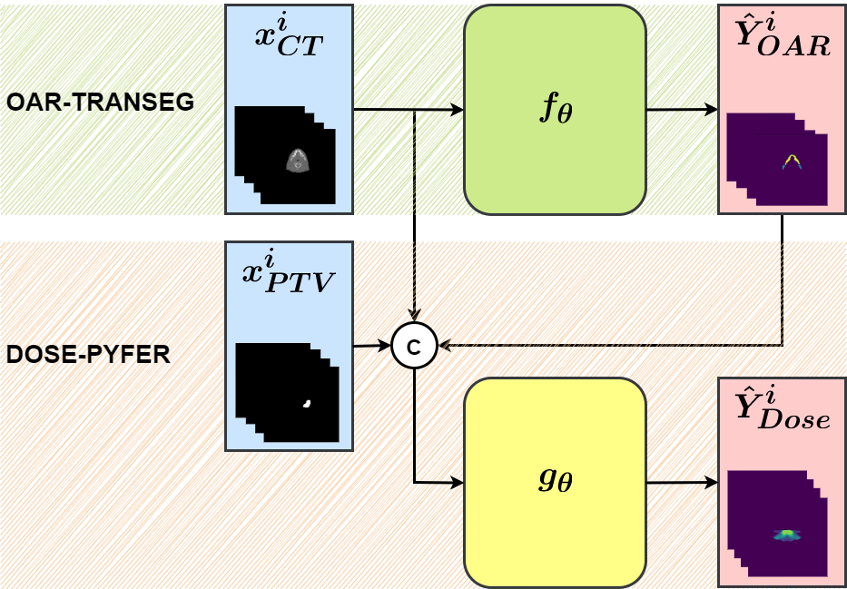
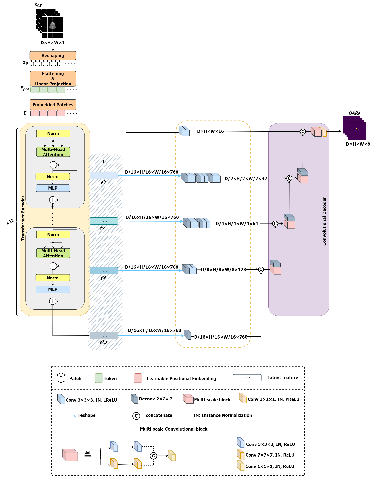
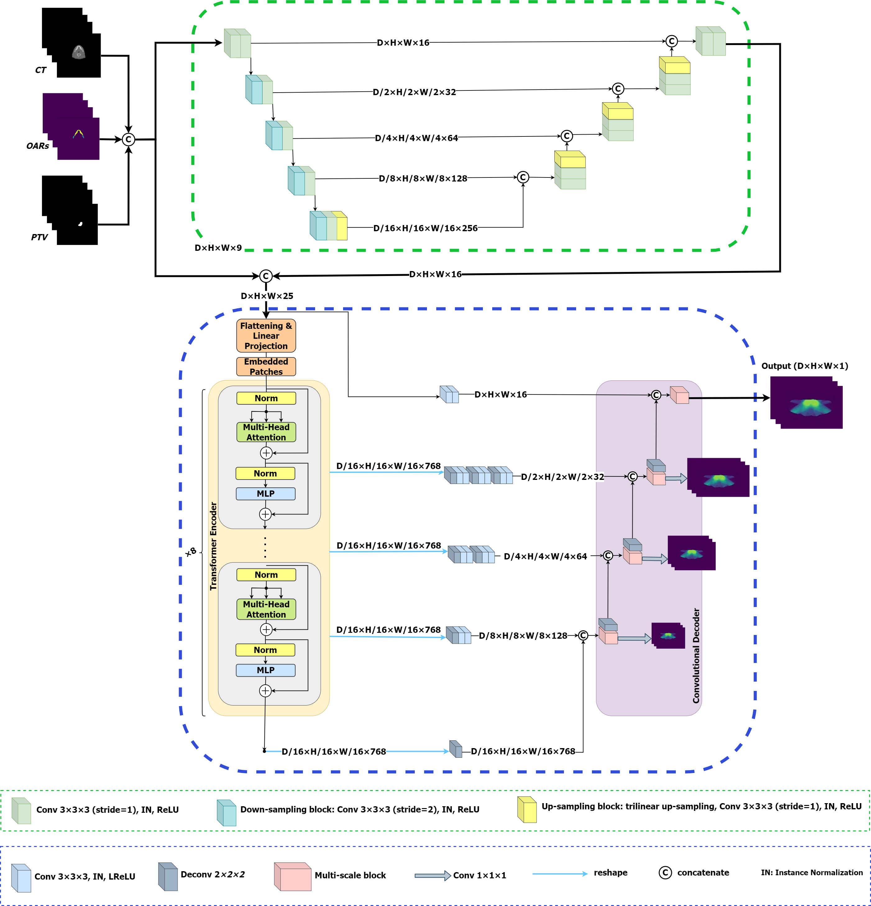

<div align="center">

<samp>

<h1> A Cascade Transformer-based Model for 3D Dose Distribution Prediction in Head and Neck Cancer Radiotherapy </h1>

[//]: # (<h4>  </h4>)

</samp>   

</div> 


Welcome to the GitHub repository for our [research paper](http://iopscience.iop.org/article/10.1088/1361-6560/ad209a), 
"A Cascade Transformer-based Model for 3D Dose Distribution Prediction in Head and Neck Cancer Radiotherapy"! 
This repository contains the implementation of our novel deep learning approach, 
which aims to revolutionize the prediction of dose distribution maps in radiation oncology.


## Introduction


Our method comprises two essential sub-networks: OARs segmentation and dose distribution prediction. By leveraging the power of deep learning, we aim to enhance the precision and efficiency of radiotherapy treatment planning for head and neck cancer patients.


Throughout this paper, we compare the performance of our proposed model with state-of-the-art deep learning methods. The comprehensive evaluation showcases our model's exceptional capabilities, as it consistently outperforms other methods in terms of various metrics.

<p align="center">
  
</p>

### Key Contributions:


**1. OAR-TRANSEG**: 
   We proposed a model consisting of multi-scale convolutional units and transformer blocks, 
   which can simultaneously extract local and global features. The simultaneous extraction of
   local and global features is one of the challenges in deep learning that we tried to address
   using this approach. This approach was used and evaluated for automatic OARs
   segmentation.
   <p align="center">
  
   </p>

**2. DOSE-PYFER**: 
   We proposed a cascade encoder-decoder model, including transformer blocks and multi-
   scale convolutional units based on a pyramid structure to predict dose distribution. The
   extensive experiments show that the proposed method outperforms the winner of the
   OpenKBP2020 challenge and other previous studies.
   <p align="center">
  
   </p>

**3. End-to-End Model**:
   In designing the proposed model, we tried to automate the dose distribution prediction as
   much as possible. Therefore, the model can automatically segment OARs by receiving CT
   images and corresponding PTVs of the patient and use the extracted OARs to predict dose
   distribution.


## Citation

If you find our code or paper useful, please cite as:

```bibtex
@article{dosepyfer2024,
  title={A Cascade Transformer-based Model for 3D Dose Distribution Prediction in Head and Neck Cancer Radiotherapy},
  author={Tara Gheshlaghi and Shahabedin Nabavi and Samire Shirzadikia and Mohsen Ebrahimi Moghaddam and Nima Rostampour},
  journal={Physics in Medicine & Biology},
  year={2024},
  url={http://iopscience.iop.org/article/10.1088/1361-6560/ad209a}
}
```
